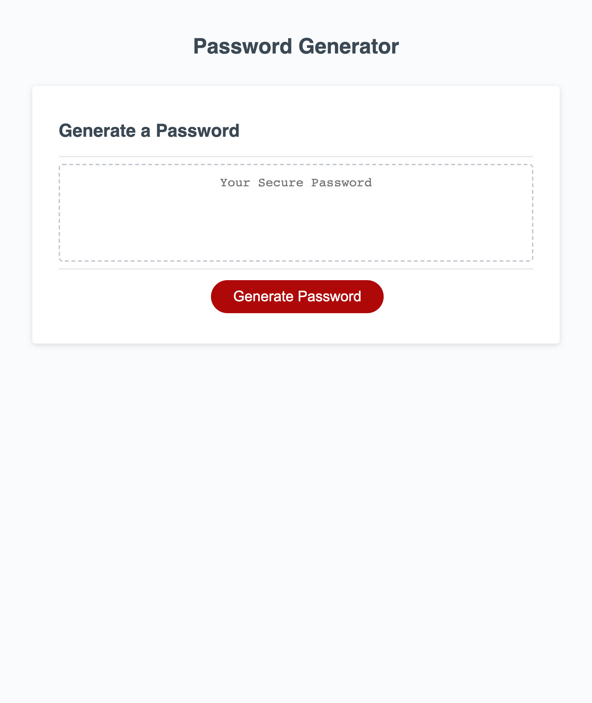

# password-simulator

## Description
    I found this project really challenging at first, I went at it all wrong and put myself through unnecessary stress when the answer was so simple.
    I was console logging it all and figured i was doing it right but others example in the class made me realize how wrong I really was. I put every option into a function when all I had to do was put alot of else if statements like it was the rock paper scissors game. I was also not putting my variable globally at first I kept putting it locally which caused ton of problems. Always a good thing to look back at old classroom recording and always good to take advice from others and look at others work online to and see how they managed to execute their code.

## Usage
    This will password generator will help you generate a strong password based off of what letters characters and numbers you want all you have to do is click generate password button and answer the questions that the window pops up to see if you want certain objects in your password then itll generate one for you.

## Link
https://joelestrada16.github.io/password-simulator/

## License
Please refer to license in the repo
